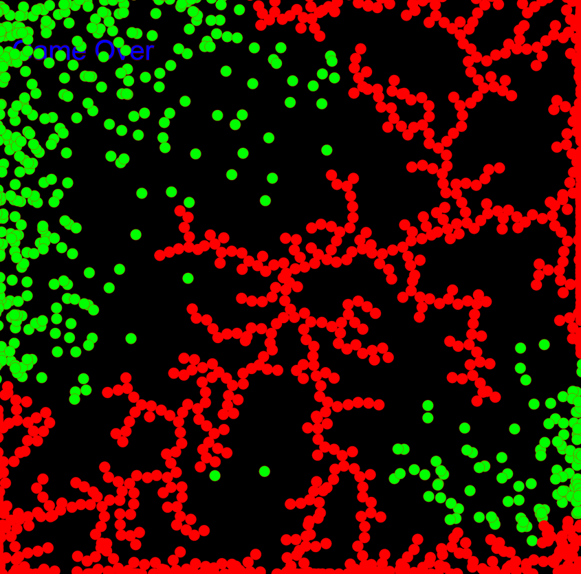

# dla
## Diffusion-Limited Aggregation

https://greggelong.github.io/dla

I am riffing on code originally from Shiffman Coding train 

coding challenge 34

I have created a version without just using vectors not objects for the dots.

dla while loop sketch doesn't animate the other dots and will crash the browser with 

the long while loop searching for a place on the tree.

link for China (not YouTube)

https://www.bilibili.com/video/BV1aW411Z7EW

